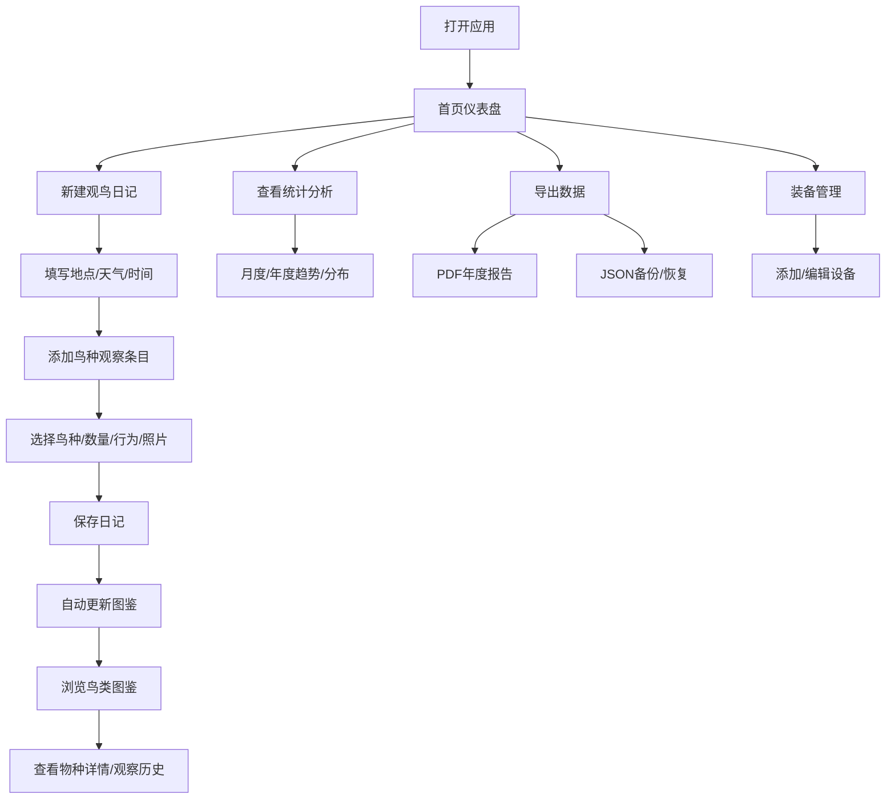

## 1. 产品概述
个人观鸟记录与鸟类图鉴收集助手，面向鸟类爱好者的纯前端Web应用，帮助用户系统化记录观鸟活动、收集鸟类图鉴、分析观鸟数据。
- 主要功能：观鸟日记记录、鸟类图鉴收集、数据统计分析、装备管理、数据导出
- 目标用户：观鸟爱好者、自然观察人士
- 核心价值：提供便携的野外观鸟记录工具，建立个人鸟类观察数据库，激励持续探索

## 2. 核心功能

### 2.1 用户角色
| 角色 | 注册方式 | 核心权限 |
|------|----------|----------|
| 普通用户 | 无需注册，本地使用 | 所有功能，数据存储于浏览器本地 |

### 2.2 功能模块
1. **首页仪表盘**：概览统计数据、快捷入口、最近记录
2. **观鸟日记**：日记列表、新建/编辑日记、鸟种记录条目
3. **鸟类图鉴**：按目科属分类浏览、已点亮/未观察区分、搜索筛选、物种详情
4. **统计分析**：累计观察数据、月度/年度趋势、栖息地与居留类型分布、愿望清单
5. **装备管理**：设备列表、添加/编辑设备、使用记录
6. **数据导出**：PDF年度报告、JSON完整备份与恢复

### 2.3 页面详情
| 页面名称 | 模块名称 | 功能描述 |
|----------|----------|----------|
| 首页仪表盘 | 统计卡片 | 累计鸟种数、观察次数、本月新增、总时长 |
| 首页仪表盘 | 快捷操作 | 新建日记、浏览图鉴、查看统计的快速入口 |
| 首页仪表盘 | 最近记录 | 最近5条观鸟日记预览 |
| 观鸟日记 | 日记列表 | 按时间排序展示所有日记，支持搜索和筛选 |
| 观鸟日记 | 新建/编辑日记 | 记录地点、天气、栖息地、同行伙伴、开始/结束时间 |
| 观鸟日记 | 鸟种条目 | 添加观察到的鸟种，记录数量、行为、照片备注 |
| 鸟类图鉴 | 分类浏览 | 按目→科→属→种层级展开浏览 |
| 鸟类图鉴 | 搜索筛选 | 按名称搜索，按是否观察、栖息地、居留类型筛选 |
| 鸟类图鉴 | 物种详情 | 展示物种基础信息、用户观察历史、首次观察记录 |
| 统计分析 | 累计数据 | 鸟种数、科数、属数、观察次数、总时长 |
| 统计分析 | 趋势图表 | 月度新增鸟种、年度观鸟次数与时长 |
| 统计分析 | 分布分析 | 按栖息地类型、居留类型的鸟种分布 |
| 统计分析 | 愿望清单 | 未观察的常见目标鸟种清单 |
| 装备管理 | 设备列表 | 展示望远镜、相机等装备信息 |
| 装备管理 | 添加/编辑设备 | 记录名称、型号、购买日期、使用频次、快门次数 |
| 数据导出 | PDF报告 | 生成年度观鸟报告PDF |
| 数据导出 | JSON备份 | 完整数据导出为JSON，支持导入恢复 |

## 3. 核心流程
用户打开应用后，从首页可快速创建观鸟日记。在日记中记录观鸟基本信息并逐条添加观察到的鸟种。保存日记后，系统自动将新观察的鸟种点亮图鉴并记录首次观察信息。用户可在图鉴中按分类浏览所有物种，在统计页面查看个人观鸟数据分析，并可导出PDF报告或JSON备份。

## 4. 用户界面设计

### 4.1 设计风格
- 主色调：橄榄绿 (#556B2F)、米白色 (#FAF8F5)、深棕色 (#3E2723)
- 辅助色：苔藓绿 (#8B9A46)、浅米色 (#F5F0E6)、土黄色 (#C4A35A)
- 按钮风格：圆角胶囊形，实心按钮配橄榄绿主色，次要按钮用米白底配深棕边框
- 字体：标题使用 Noto Serif SC（衬线体，自然雅致），正文使用 Noto Sans SC（易读）
- 布局风格：卡片式布局，自然留白，模拟纸质笔记本质感
- 图标风格：Lucide 线性图标，自然主题，线条柔和
- 背景纹理：细微的纸张纹理或自然噪点，营造户外记录册氛围

### 4.2 页面设计概览
| 页面名称 | 模块名称 | UI元素 |
|----------|----------|--------|
| 首页仪表盘 | 统计卡片 | 四色统计卡片，带图标和数字，悬停微上浮效果 |
| 首页仪表盘 | 快捷操作 | 三个大图标按钮，带渐变背景 |
| 首页仪表盘 | 最近记录 | 时间线条目，卡片式，左侧日期右侧摘要 |
| 观鸟日记 | 日记列表 | 瀑布式卡片列表，地点+日期+鸟种缩略 |
| 观鸟日记 | 新建表单 | 分组表单，标签左对齐，输入框米色背景 |
| 观鸟日记 | 鸟种条目 | 可折叠列表，条目包含鸟种名、数量、行为标签 |
| 鸟类图鉴 | 分类树 | 侧边树形导航，可展开目→科→属 |
| 鸟类图鉴 | 物种网格 | 响应式网格卡片，已点亮彩色、未观察灰色 |
| 鸟类图鉴 | 物种详情 | 大图展示，信息分组卡片，观察时间线 |
| 统计分析 | 图表区域 | 柱状图展示月度趋势，饼图展示分布 |
| 统计分析 | 愿望清单 | 带勾选框的目标清单，可标记观察状态 |
| 装备管理 | 设备卡片 | 设备卡片网格，显示图标、名称、型号、关键参数 |
| 数据导出 | 导出按钮 | 大按钮卡片，带格式图标和说明文字 |

### 4.3 响应式
- 移动端优先设计，断点：640px（移动）、768px（平板）、1024px（桌面）
- 移动端底部Tab导航，桌面端左侧侧边栏导航
- 表单输入区域针对触控优化，按钮最小高度48px
- 图鉴网格在移动2列、平板3列、桌面4-5列自适应
- 图表区域支持手势缩放

### 4.4 动效设计
- 页面切换：渐入过渡（opacity + translateY）
- 卡片悬停：轻微上浮（translateY -4px）+ 阴影加深
- 图鉴点亮：首次点亮时播放缩放闪烁动画
- 数据加载：骨架屏脉冲动画
- 按钮点击：涟漪效果
