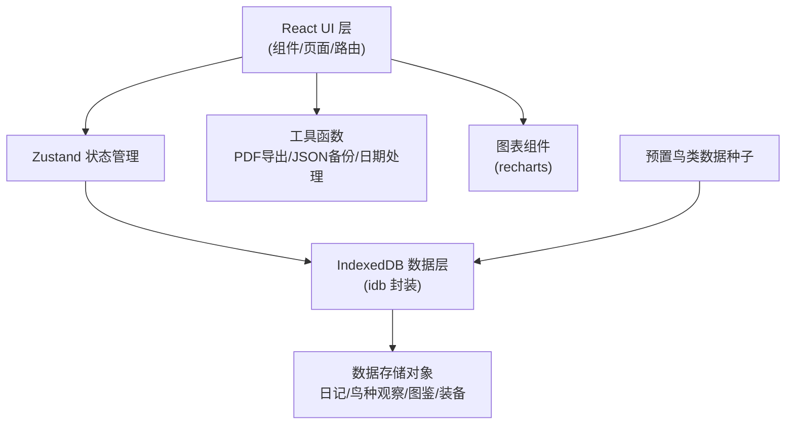
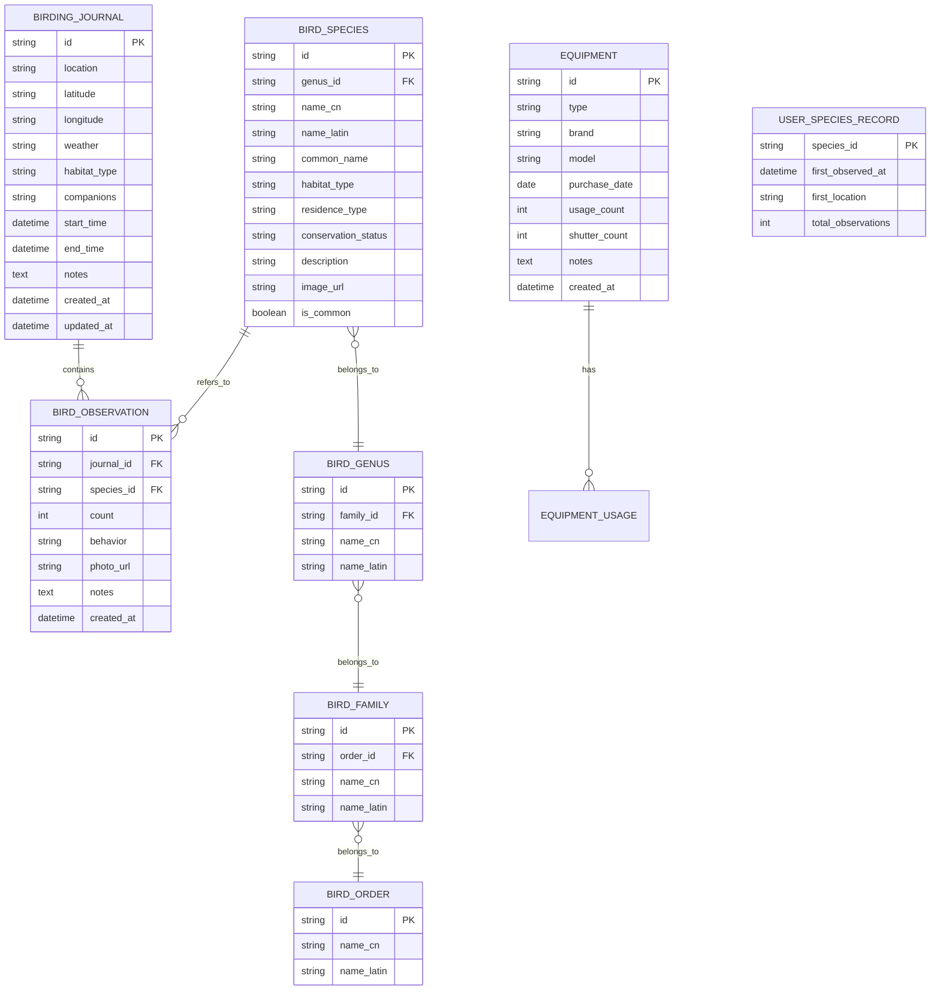

## 1. 架构设计


## 2. 技术描述
- 前端框架：React@18 + TypeScript + Vite
- 路由：react-router-dom@6
- 状态管理：zustand
- 样式：tailwindcss@3
- 本地数据库：IndexedDB（idb 库封装）
- 图表：recharts
- PDF导出：jsPDF + html2canvas
- 图标：lucide-react
- 初始化工具：vite-init react-ts 模板

## 3. 路由定义
| 路由 | 用途 |
|------|------|
| / | 首页仪表盘 |
| /journal | 观鸟日记列表 |
| /journal/new | 新建观鸟日记 |
| /journal/:id | 查看/编辑日记详情 |
| /species | 鸟类图鉴首页（目列表） |
| /species/:orderId | 某目下的科列表 |
| /species/:orderId/:familyId | 某科下的属/种列表 |
| /species/:orderId/:familyId/:speciesId | 物种详情页 |
| /statistics | 统计分析 |
| /equipment | 装备管理 |
| /export | 数据导出 |

## 4. 数据模型

### 4.1 数据模型ER图


### 4.2 IndexedDB Store 定义
- **bird_orders**：鸟类目数据（预置数据，keyPath: id）
- **bird_families**：鸟类科数据（预置数据，keyPath: id，索引: order_id）
- **bird_genera**：鸟类属数据（预置数据，keyPath: id，索引: family_id）
- **bird_species**：鸟类物种数据（预置数据，keyPath: id，索引: genus_id, habitat_type, residence_type）
- **journals**：观鸟日记（用户数据，keyPath: id，索引: created_at, location）
- **observations**：鸟种观察记录（用户数据，keyPath: id，索引: journal_id, species_id）
- **user_species_records**：用户图鉴记录（用户数据，keyPath: species_id）
- **equipment**：装备管理（用户数据，keyPath: id）

## 5. 核心模块划分
```
src/
├── components/         # 可复用UI组件
│   ├── Layout/         # 布局组件（导航、侧边栏、容器）
│   ├── Journal/        # 日记相关组件
│   ├── Species/        # 图鉴相关组件
│   ├── Stats/          # 统计相关组件
│   ├── Equipment/      # 装备相关组件
│   └── Common/         # 通用组件（按钮、卡片、表单）
├── pages/              # 页面组件
├── hooks/              # 自定义hooks（useIndexedDB等）
├── stores/             # zustand状态管理
├── utils/              # 工具函数
│   ├── db.ts           # IndexedDB封装
│   ├── seed.ts         # 预置鸟类数据
│   ├── date.ts         # 日期处理
│   ├── pdf.ts          # PDF导出
│   └── backup.ts       # JSON备份
├── types/              # TypeScript类型定义
└── assets/             # 静态资源
```
